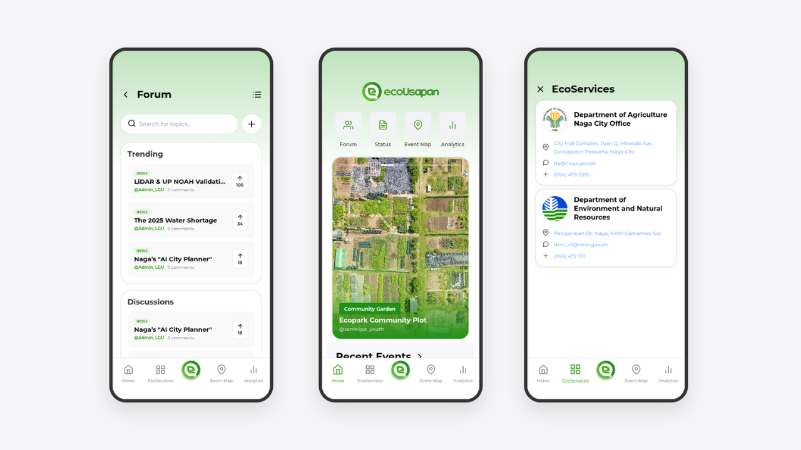

  <h3>1st Naga City Mayoral Hackathon Entry</h3>
  <h3>Environment Semi-Finalist</h3>
  
<a href="https://drive.google.com/file/d/1FBwSv0i7DCKIJO0Gp72FfxMdcycqthDE/view"><b>Event Brochure</b></a>

  <h1>ecoUsapan</h1>
  
  
<i>Empowering Naga City through transparent communication and environmental action.</i>

  
<b>Team Members:</b> 
  LordyJohn Prestado • Mark Joseph Orias • Jessica Mae Lanuzo 
  Guiller Angelo Hermoso • Jim Rafael Santorcas

  
<b>Camarines Sur Polytechnic Colleges</b>

## **Live Deployment**

The application is deployed and accessible at: **[ecousapan.vercel.app](https://ecousapan.vercel.app)**

> **Note**: For the best experience with this prototype, please access the application on a desktop or laptop device.

## **Key Features**

- **Dynamic Forum**: Engage in community discussions with real-time search, category filtering (News, Questions, Suggestions, etc.), and a robust Upvote/Downvote system.
- **Environmental Initiatives**: Users can propose cleanup drives or tree-planting events. Admins (LGU) can review, approve, or decline these proposals.
- **Service Requests**: Streamlined access to government services such as requesting rice seeds (DA) or mahogany seedlings (DENR).
- **Participation Tracking**: A personal dashboard for users to track the status of their service requests and registered events.
- **Role-Based Access**: Dedicated administrative dashboards for LGU, DA, and DENR officials to manage approvals and community data.

## **Design & Wireframes**

The project's design and user flow were planned using Figma. You can view the wireframes here:
**[View Figma Wireframe](https://www.figma.com/design/MMjzMPVc14L3PwDXDYobGE/Wireframe?node-id=2536-33&t=QMXKTJlmBt1Yqdlu-1)**

## **Technology Stack**

- **Backend**: Python, Flask
- **Database**: SQLite with SQLAlchemy ORM
- **Frontend**: HTML5, CSS3 (Mobile-first design), JavaScript (ES6+)
- **Authentication**: Flask-Login

## **Installation & Setup**

Follow these steps to get the project running on your local machine:

1. **Clone the Repository**  
   git clone \[https://github.com/yourusername/ecoUsapan.git\](https://github.com/yourusername/ecoUsapan.git)  
   cd ecoUsapan

2. **Create a Virtual Environment**  
   python \-m venv venv  
   \# Windows:  
   venv\\Scripts\\activate  
   \# Mac/Linux:  
   source venv/bin/activate

3. **Install Dependencies**  
   pip install \-r requirements.txt

4. **Initialize the Database**  
   Instead of manually creating tables, use the provided system seeder to set up the schema and test data:  
   python seed.py

5. **Run the Application**  
   python main.py

   Access the app at http://127.0.0.1:5000

## **Testing with Seed Data**

The `seed.py` script automatically resets the database and creates the following test accounts (Password: **password123**):

- **Superadmin**: superadmin@ecousapan.com
- **LGU Admin**: lgu@ecousapan.ph
- **DA Admin**: da@ecousapan.ph
- **DENR Admin**: denr@ecousapan.ph
- **Standard User**: tester@gmail.com

### **Controls**

- **View Login Page**: Navigate to `http://127.0.0.1:5000`. If you are not authenticated, you will be redirected to the login page.
- **Logout**: Press **Shift + L** on your keyboard to logout instantly.

## **Project Structure**

- **webapp/**: Main application package.
  - ****init**.py**: App factory and configuration.
  - **auth.py**: Authentication logic (Login/Signup).
  - **views.py**: Main application routes and business logic.
  - **models.py**: Database schemas and ORM models.
  - **templates/**: Jinja2 HTML templates for all views.
  - **static/**: Frontend assets (CSS, JS, Fonts, Icons, Images).
- **instance/**: Local database storage (SQLite).
- **main.py**: Application entry point.
- **seed.py**: System seeder for database initialization and mock data.
- **requirements.txt**: List of Python dependencies.
